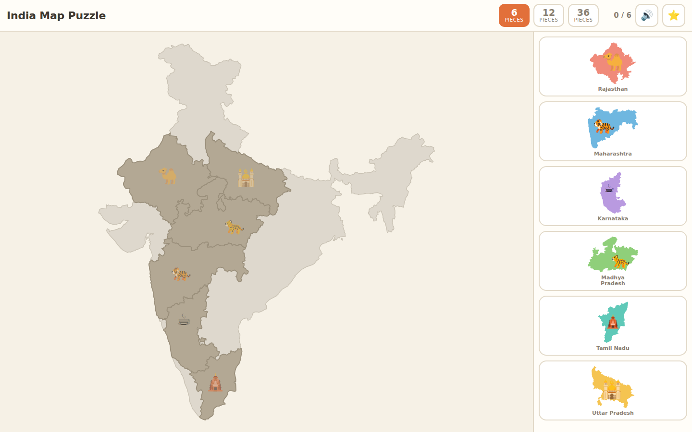
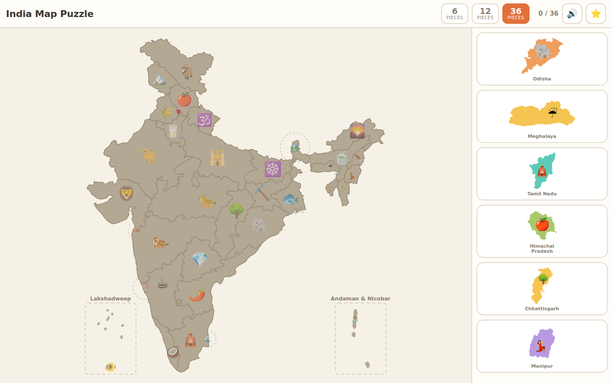
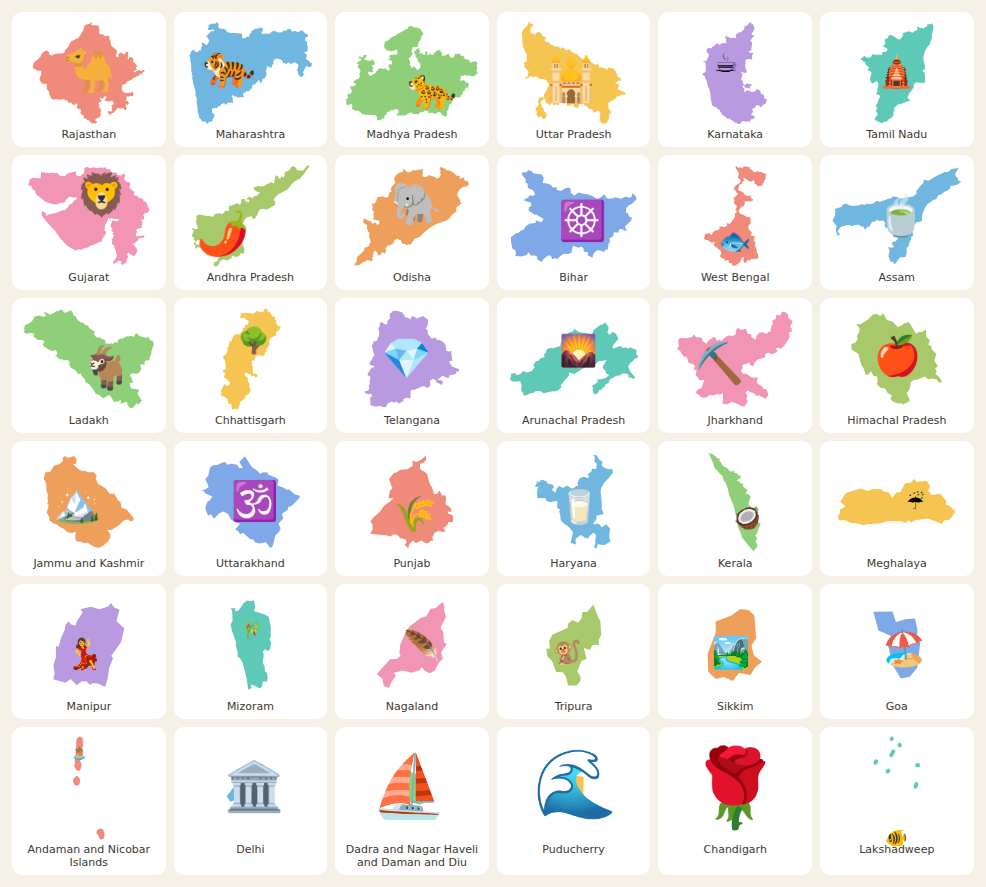

# India Map Puzzle

A map-of-India jigsaw for a four-year-old. Each state is a piece you drag onto
the map; it snaps home, says its own name out loud, and goes in the sticker book.



## Playing it — three ways

| Where | What to open |
|---|---|
| **Tablet or phone** | `dist/india-map-puzzle.html` — one self-contained file. Copy it to the device and open it **in Chrome**. |
| **Desktop** | `index.html` from the project folder. Double-click it; that is the whole install. |
| **Hosted** | Any static host. GitHub Pages serves it from `main` / `/ (root)`. |

**On Android, do not tap the `.html` file in a file manager.** The manager hands
it to a preview WebView that disables JavaScript, and often copies just that one
file into a cache directory — so `./js/` and `./data/` are not merely blocked,
they are absent. You get the header and a blank page. Use *Open with → Chrome*,
or type the path into Chrome directly:
`file:///storage/emulated/0/Download/india-map-puzzle.html`.

That is exactly what `dist/india-map-puzzle.html` is for: with everything inlined,
there are no sibling files left to lose. Regenerate it with `npm run bundle`.
iOS has no good local-file story at all — host it instead.

There is no build step, no bundler and no runtime dependencies in any of the
three cases.

---

## Built for a four-year-old, specifically

That one constraint decided almost everything here.

- **There is no way to lose.** No timer, no score, no "wrong" buzzer. A miss
  costs nothing.
- **The game gives in before the child does.** Miss the same piece three times
  and its slot starts pulsing. Miss it five times and dropping it anywhere on the
  map sends it home.
- **Three sizes of puzzle.** Six big states, then twelve, then all thirty-six.
  The rest of India stays on screen in grey the whole time, so even the six-piece
  game still looks like India rather than six shapes floating in space.
- **Nothing depends on reading.** Every state carries a unique emoji — 🐪 for
  Rajasthan, 🥥 for Kerala, 🐅 for Maharashtra — shown on both the piece and the
  hole it belongs in. A child who cannot read a word can still match a camel to a
  camel. The build fails if two states ever share an emoji.
- **It says the names.** Picking a piece up and putting it down both speak the
  state's name, so the word attaches to the shape.
- **Only six pieces are offered at a time**, drawn from a shuffled queue, with at
  least one big easy one always among them. A tray of thirty-six choices is where
  a small child stops.
- **Everything is big.** No tap target under 64px.



---

## Playing

| | |
|---|---|
| **Drag** | Works with finger, mouse or stylus. The snap radius is huge — at six pieces it is 18% of the map's width. |
| **Keyboard** | Tab to the tray, arrow keys to choose, Enter to place. This is also how a grown-up helps. |
| **Sound** | One button mutes both effects and speech. It is remembered. |
| **Stickers** | A sticker for every state ever placed, plus a trophy per level. Saved on the device. |

---

## How it is put together

```
index.html          the whole game, sticker book included
dist/               GENERATED single-file build (npm run bundle)
css/styles.css
data/states.js      GENERATED map data, ~56 KB -- see "Regenerating" below
js/
  config.js         every tunable: snap radii, tray size, palette, level sizes
  util.js
  store.js          localStorage, with an in-memory fallback that never throws
  audio.js          all sound, synthesised -- there are no audio files anywhere
  speech.js         speechSynthesis, degrading to silence
  effects.js        confetti and flourishes
  render.js         builds the board SVG and the tray tiles
  drag.js           Pointer Events, the drag ghost, the snap test
  game.js           levels, tray queue, wiring
  stickers.js       sticker-book overlay
tools/              build-time only, never shipped to the browser
tests/              Playwright
```

Three decisions are worth knowing before changing anything:

**No ES modules.** Module scripts are fetched with CORS semantics, and on
`file://` the origin is `null`, so every `import` is blocked — Chrome refuses
outright and Firefox has since v68. Since "double-click index.html" is a
requirement, the app uses classic `<script defer>` tags in a fixed order and
hangs everything off one `window.IMP` namespace. There is no flag-free way around
this, so please do not "modernise" it.

**All paths are relative** (`./js/x.js`). A root-absolute path breaks both
`file://` and GitHub Pages project sites, which serve from `/<repo>/`.

**The dragged piece is an HTML `<div>`, not an SVG node.** SVG has no z-index, so
lifting a piece above the board would mean re-appending DOM nodes mid-drag. A
fixed-position div is always on top, is GPU-composited, and takes a cheap CSS
`drop-shadow`. The board SVG is only used to convert the drop point into map
coordinates. All hit-testing happens in viewBox units, never pixels, so snapping
behaves identically on a phone and a 4K monitor.

---

## Regenerating the map

`data/states.js` is generated and committed. You only need this if you want to
change the source data or how chunky the pieces are.

```bash
npm install     # mapshaper + playwright, build-time only
npm run build   # fetch -> dissolve/simplify -> project -> verify
```

What that does:

1. **fetch** — downloads `udit-001/india-maps-data`, pinned to commit `2884453`.
   TopoJSON rather than GeoJSON, and that matters: TopoJSON stores each shared
   border once, as an arc, so simplification moves both sides of every border
   identically. Simplifying independent polygons is how you get hairline cracks
   between states.
2. **map** — mapshaper cleans and simplifies. `SIMPLIFY=70%` by default; lower it
   and small states start losing their islands, so the knob is bounded from below
   by island survival rather than by shape quality.
3. **project** — Lambert Conformal Conic (standard parallels 12.47°N / 35.17°N,
   the pair the Survey of India uses), which holds scale error within about ±1.5%
   across the country. Equirectangular would make the north ~20% too wide and
   Mercator ~20% too tall — and a puzzle piece is looked at in isolation, with
   nothing beside it to correct for a distorted outline.
4. **verify** — the gate. Checks the obvious things, then samples a 500×500 grid
   and asserts the states actually tile: currently 99.99% coverage, 0% overlap.

Curated per-state data (emoji, level, pronunciation, sticker caption) lives in
`tools/meta/states.json`, deliberately outside the generated file so regenerating
never destroys it.



---

## Tests

```bash
npm test
```

Fourteen Playwright tests, run against both `file://` and `http://`. The three that
earn their keep:

- **The gap test** paints the silhouette red, paints all 36 states over it in
  black, and counts surviving red pixels. It is the only check that would catch
  the pieces failing to tile.
- **The touch-drag test** drives real `touchStart`/`Move`/`End` through CDP,
  because `page.touchscreen` only exposes `tap()` and the actual player will
  never use a mouse.
- **The single-file test** copies `dist/india-map-puzzle.html` alone into an
  empty temp directory and loads it there — the honest reproduction of what an
  Android file manager does — then drags a piece and opens the sticker book.

The rest cover: loading with zero console errors, a correct drop, a wrong drop
returning to the tray with no ghost left stranded, finishing a level and the
sticker surviving a reload, still working with `speechSynthesis` and
`AudioContext` deleted, and creating no `AudioContext` before the first gesture
(doing so before a user gesture leaves it suspended and the game silent forever).

`npm test` also refreshes `tests/screenshots/`, including `pieces.png` — the
contact sheet to eyeball after changing the simplification level. Watch West
Bengal's Siliguri corridor and the Kerala coastal strip; they pinch first.

### Worth testing by hand

Synthetic touch events are not a finger. They do not reproduce coalescing, palm
rejection, or the browser's scroll-versus-drag heuristic — and `pointercancel`,
which fires when the browser decides your drag was really a scroll, can only be
properly exercised on real hardware. Try it on an actual tablet in both
orientations. Then hand it to the four-year-old and watch where they get stuck.

---

## Deploying

Hosted on GitHub Pages, served straight from the branch — **Settings → Pages →
Source: "Deploy from a branch" → `main` → `/ (root)`**. Every push to `main` rebuilds it.

There is deliberately no Actions workflow. The site is static files at the repository root
with nothing to compile, so a build pipeline would only add moving parts — and it did: an
Actions deploy needs the `github-pages` environment, whose auto-created deployment-branch
policy is pinned to whatever the default branch was when Pages was first enabled, and it
rejects runs from any other branch before they even get a runner.

Two things make the subpath work, and both matter because project sites are served from
`/<repo>/` rather than the domain root:

- every path in the HTML, CSS and JS is relative (`./js/x.js`, never `/js/x.js`);
- `.nojekyll` is committed, so Jekyll does not process the tree.

## Known compromises

- **Exclaves are collapsed.** Puducherry is really four territories scattered
  over ~700km across three states; Dadra and Nagar Haveli and Daman and Diu is
  three. One draggable piece cannot span that, so only the largest part of each
  is kept. This loses real territory.
- **Andaman & Nicobar and Lakshadweep are drawn in enlarged inset boxes**, the
  convention printed atlases use, because at true position and scale they are
  unclickable specks. Their islands are also stroked fat so they read as dots
  rather than sub-pixel dust — the geometry is untouched, only the pen is wider.
- **Lakshadweep was repaired from a second source.** The combined topology has it
  as a 4-vertex sliver about 4km across, for an archipelago that really spans
  3.4° of latitude. The per-state file has the real 35 islands, and since
  Lakshadweep borders nothing, splicing it in cannot disturb anyone else's
  topology.
- **Boundaries are not authoritative.** They follow the source dataset —
  including for Jammu and Kashmir, Ladakh and Arunachal Pradesh, which are
  disputed — and are then heavily simplified. See [NOTICE.md](./NOTICE.md).
- **The map data's licence is genuinely unclear.** Upstream ships no LICENSE
  file. Attribution is best-effort and documented in NOTICE.md.
- **Emoji come from the system font.** A device with no colour-emoji font shows
  tofu boxes; set `USE_EMOJI: false` in `js/config.js` to fall back to names.
- **iOS cannot really open `file://` pages**, and its `localStorage` is unreliable
  there, so stickers may not persist. Host it instead — GitHub Pages works, and
  `.nojekyll` is already in place.

## Licence

Code is MIT. Map data is not ours — see [NOTICE.md](./NOTICE.md).
